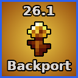

<p align="center"></p>

<h1><p align="center">26.1 Backport</p></h1>

<p align="center">Backports Minecraft 26.1 features to 1.21.11 minus the baby mob remodels.</p>

<div align="center">

[Download on Modrinth](https://modrinth.com/mod/26.1-backport/versions) |
[Download from Releases](https://github.com/BJTMastermind/26.1-backport/releases)

</div>

## About The Project

**26.1 Backport** is a small mod that backports some of the 26.1 Drops features to 1.21.11 including the golden dandelion, craftable name tags, stone/deepslate to cobblestone/cobbled deepslate stonecutter recipes, and the trumpet instrument for note blocks!

> [!caution]
> The **26.1** version of the mod is required to correctly migrate the mods backported golden dandelion to the vanilla equivalent. Once all chunks containing golden dandelions (blocks, items, in containers, etc) have been loaded in 26.1 or the "Optimize World" button is used (Singleplayer Only) you can safely remove the mod.

## Run

1. Download `backport_261-x.x.x+mc26.1.jar` from one of the places at the top of this README.
2. Copy the downloaded jar file to your `mods` folder.

## Getting Started With Development

To get a local copy up and running, follow these simple steps.

### Prerequisites

Ensure you have the following installed on your machine:

* **Java Development Kit (JDK)**: Version 25 or higher.
  * [Download JDK](https://adoptium.net/)
* **Gradle**: Version 9.2 or higher.
  * [Install Gradle](https://gradle.org/install/)
* **Minecraft**: Version 26.1

### Build

1. **Clone the repository**
```sh
git clone https://github.com/BJTMastermind/26.1-backport.git
```

2. Navigate to the project directory
```sh
cd 26.1-backport
```

3. Build the project with Gradle
```sh
./gradlew clean build
```

You can find the built mod at `26.1-backport/build/libs/backport_261-x.x.x+mc26.1.jar`.
